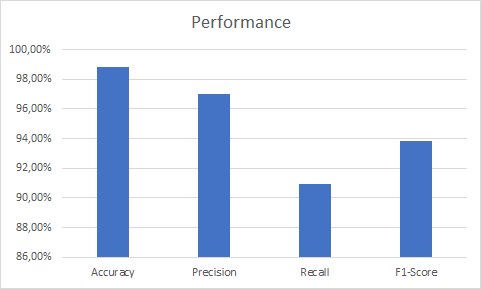
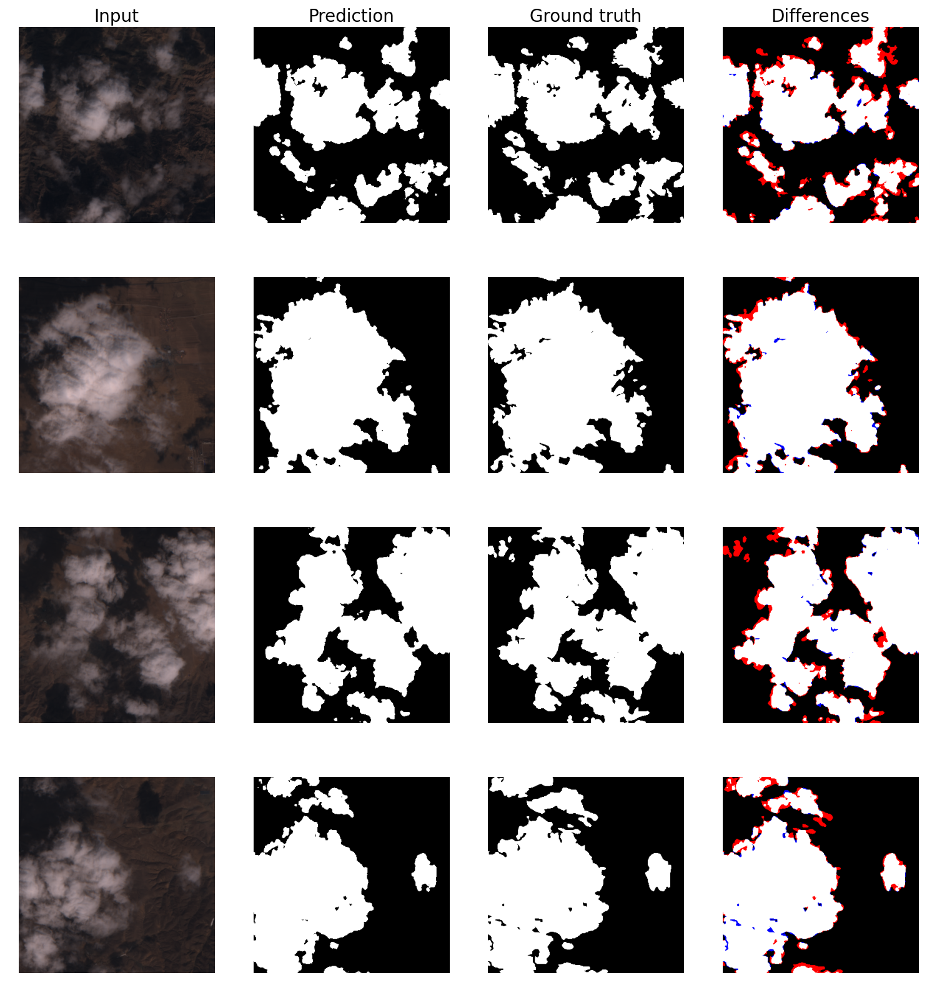

# Cloud Detection with Deep Learning

This is the project related to the thesis/project-report for my barchelor's degree. The project is the implemenatton of a light weight deep learning neural network model that perform a semantic segmentation task to identify clouds in satellite images.

The original thesis is written in italian and can be read [here](./assets/thesis.pdf).

## Abstract

The automatic detection of clouds in satellite images is a crucial task that is useful in countless applications ranging from meteorology to land analysis. For such a complex task, software based on classical algorithms is no longer sufficient, so more advanced solutions such as those based on Deep Learning like convolutional neural networks are necessary.

However, these models often require expensive hardware because they are computationally expensive both to train and to execute. In this paper, a new model will be presented and analyzed, capable of handling all the spectral information coming from the Sentinel-2A satellite, with the aim of demonstrating that it is possible to obtain results comparable to the current state of the art even by drastically reducing the number of parameters.

Finally, to demonstrate the success of this project, in addition to visual examples, various metrics are introduced to produce data for comparison with other solutions currently used for this task. To confirm its performance in all scenarios, the model will be put under stress with images containing snow and ice in the background, where in some cases classification is difficult even for the human eye.

## Results



As shown in the graph, the model achieves excellent results in line with the other more complex models currently used, despite the fact that these have a much greater number of parameters.

In addition to the accuracy which is 98%, to better evaluate the model, I also collected the precision and recall which are 3% and 4% respectively; the high accuracy and precision indicate that the model is highly reliable, but the slightly lower recall suggests that the model is more likely to miss some clouds than to misidentify other objects as such.

### Visual test



In this image 4 columns are shown which are respectively:
1) The satellite image to be analyzed in which only the RGB channels are shown;
2) The output of the model to which the threshold has already been applied;
3) The label representing the ground truth, like those used to train the model;
4) An image in which the differences between the prediction and the ground truth are emphasized.

In particular, to have a better comparison I colored the false negatives in red and the false positives in blue; in this way you can appreciate the difference between precision and recall, but also notice that most pixels were classified correctly.

## Build & Run

### Requirements

TODO: to be defined

### Train

You can run a train session with teh command:
```bash
python train.py <save_file_name> [create_if_not_exist]
```

#### Examples

If you already have the save file you want to use to resore the saves you can run
```bash
python train.py existing_save_file.pth
```

If you want to start a new training session with a new file for saving you can run:
```bash
python train.py save_file_to_be_created.pth create_if_not_exist
```

### Test

TODO: to be defined

### Examples generator

TODO: to be defined